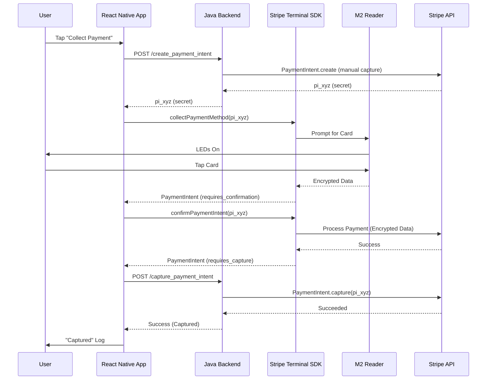

# Stripe Terminal E2E Payment Flow Documentation

This document outlines the end-to-end payment flow for the Stripe Terminal integration, detailing the interactions between the React Native app, the Java Backend, and the Stripe SDK.

## Key Files
- **Frontend (React Native)**
    - [`src/api/api.ts`](file:///Users/sanjivankumar/Documents/Boons%20Work/Github/Stripe%20Example/stripe-terminal-react-native/example-app/src/api/api.ts): Handles HTTP requests to the backend.
    - [`src/screens/CollectCardPaymentScreen.tsx`](file:///Users/sanjivankumar/Documents/Boons%20Work/Github/Stripe%20Example/stripe-terminal-react-native/example-app/src/screens/CollectCardPaymentScreen.tsx): Main UI and logic for the payment flow.
- **Backend (Java Spring Boot)**
    - [`TerminalController.java`](file:///Users/sanjivankumar/Documents/Boons%20Work/Github/Stripe%20Example/java-server/src/main/java/com/example/terminalbackend/TerminalController.java): REST controller handling PaymentIntent creation and capture.

## Flow Overview
The flow follows the standard Stripe Terminal interactions: **Create Intent -> Collect Method -> Confirm -> Capture**.

### 1. Create Payment Intent
The flow starts when the user enters an amount and taps "Collect payment".

- **Frontend**: `_createPaymentIntent` in `CollectCardPaymentScreen.tsx` calls `api.createPaymentIntent`.
- **API Call**: `POST /create_payment_intent`
    - **Payload**: `{ amount, currency, payment_method_types: ['card_present'], capture_method: 'manual' }`
- **Backend**: `TerminalController.java` receives request.
    - Calls Stripe Java SDK: `PaymentIntent.create(...)`.
    - **Note**: `capture_method` is set to `MANUAL` (Line 58).
    - Returns `{ secret: "pi_..._secret_...", id: "pi_..." }`.
- **Frontend**: Receives `client_secret`.
    - If `discoveryMethod` is 'internet', it calls `retrievePaymentIntent(client_secret)` to hydrate the object.

### 2. Collect Payment Method
Once the PaymentIntent is created, the app prompts the reader to collect the card.

- **Frontend**: `_collectPaymentMethod` is called with the `paymentIntent`.
- **SDK Call**: `collectPaymentMethod({ paymentIntent })` (Line 311).
- **Physical Action**: The M2 reader LEDs light up, waiting for a card tap/dip/swipe.
- **Result**:
    - Returns an updated `paymentIntent` object.
    - Status changes from `requires_payment_method` to `requires_confirmation`.
    - **Note**: Sensitive card data is encrypted and not available to the app directly.

### 3. Confirm Payment Intent
After successful collection, the payment must be confirmed to proceed to authorization.

- **Frontend**: `_confirmPaymentIntent` is called.
- **SDK Call**: `confirmPaymentIntent({ paymentIntent })` (Line 364).
- **Process**: The SDK sends the encrypted card data and `client_secret` to Stripe.
- **Result**:
    - Returns an updated `paymentIntent`.
    - Status is now `requires_capture` (because `capture_method` was 'manual').
    - If successful, `paymentIntent.charges[0].id` is available (Line 403).

### 4. Capture Payment Intent
Finally, the app tells the backend to capture the funds.

- **Frontend**: `_capturePayment` is called with `paymentIntent.id` (Line 415).
- **API Call**: `POST /capture_payment_intent`
    - **Payload**: `{ payment_intent_id: "pi_..." }`
- **Backend**: `TerminalController.java` receives request.
    - Calls `PaymentIntent.retrieve(id)`.
    - Calls `intent.capture(params)` (Line 82).
- **Result**:
    - Backend returns updated status (e.g., `succeeded`).
    - Frontend logs "Captured" (Line 444).

## Summary Diagram

